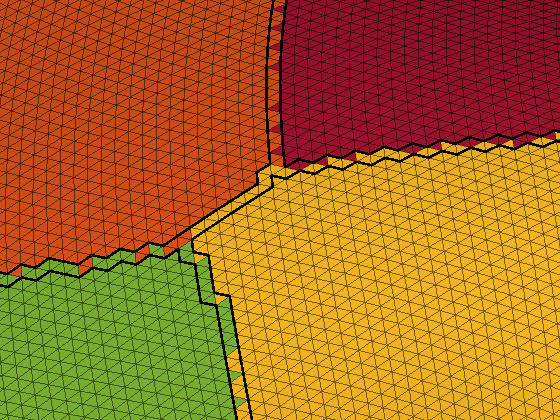
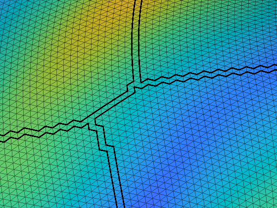

# plotSurfaceROIBoundary

These scripts will plot the boundaries of a ROI on a surface. 

There are four ways of defining a boundary here, 'faces', 'midpoint', 'centroid', and 'edges'.

'faces' will find the faces which exist between ROIs and those will be coloured black to specify the boundary. 'midpoint' finds the edges that connected the vertices of two different ROIs and takes the midpoint of the egde and uses those coordinates to define the boundary. 'centroid' finds the faces which exist between ROIs and uses the centroid of those to draw the coordinates that define the boundary. 'edges' finds the edges which define the boundary of the ROI and draws the boundary along that. demo_plotSurfaceROIBoundary.m shows examples of how the code is used. See plotSurfaceROIBoundary.m, makeFaceVertexCData.m, and findROIboundaries.m for a more detailed description. I personally recommend using 'midpoint', visually it looks the cleanest and you can easily change the thickness/width of the boundary. 'faces' will look clean but you cannont change the thickness/width, 'centroid' doesn't look especially neat but you can change the thickness, while with 'edges' the boundaries of adjacent ROIs will leave a slight gap between them (i.e. they don't overlap) which can look a bit strange.

example_surface_data.mat includes vertices and faces for fsaverage, along with parcellations for the Desikan-Killiany atlas, HCPMMP1 parcellation, and a random 200 (100 ROIs per hemisphere) parcellation.

The first four figures show the different types of boundary method projected over the surface where each face is coloured according to the vertex ROI IDs. While a face can be connected to multiple ROIs, each face is colored by the value of the first vertex that constitutes that face (in other words, when plotting each face appears to only be assigned to one ROI when it infact belongs to multiple). This is one reason why the boundary looks jagged. Anatomically based parcellations (like the Desikan-Killiany and HCPMMP1 parcellations) also tend to produce jagged boundaries. All these figures can be replicated using demo_plotSurfaceROIBoundary.m

'faces'

'midpoint'

'centroid'

'edges'

The next four figures show the different types of boundary method projected over the surface where each face is coloured according to an interpolated value of the vertex values (which in this case is the sulcal depth of each vertex).

'faces'

'midpoint'

'centroid'

'edges'

