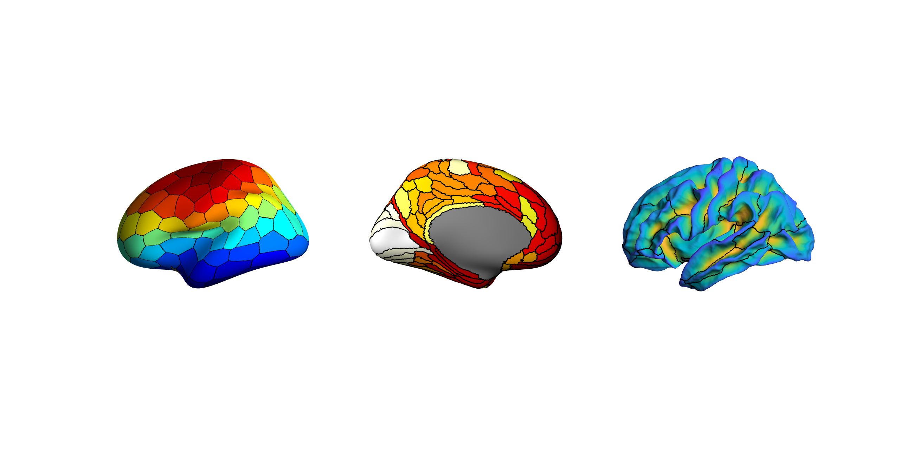
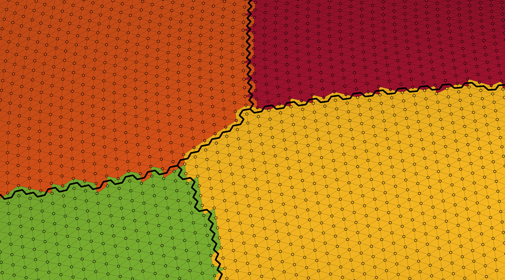
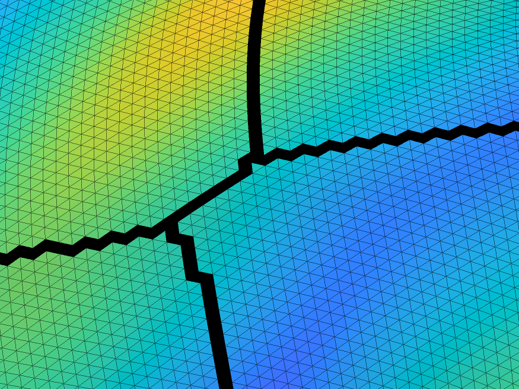
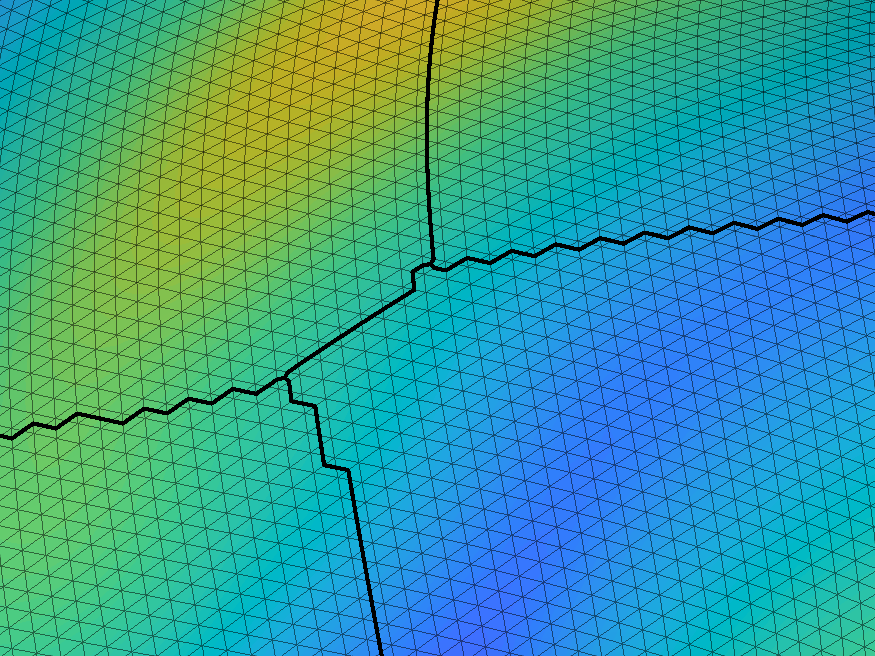

# plotSurfaceROIBoundary
Plot the boundaries of ROIs on a surface

This script will plot the boundaries of a roi on a surface. 

The script has three ways of defining a boundary, 'faces', 'midpoint', and 'centroid'.

'faces' will find the faces which exist between rois and those will be coloured black to specify the boundary. 'midpoint' finds the edges that connected the vertices of two different rois and takes the midpoint of the egde and uses those coordinates to define the boundary. 'centroid' finds the faces which exist between rois and uses the centroid of those to draw the coordinates that define the boundary. demo_plotSurfaceROIBoundary.m shows examples of how the code is used. See plotSurfaceROIBoundary.m, makeFaceVertexCData.m, and findROIboundaries.m for a more detailed description.

The first three figures show the different types of boundary method projected over the surface where each face is coloured according to the vertex roi ids. While a face can be connected to multiple rois, each face is colored by the value of the first vertex that constitutes that face (in other words, when plotting each face appears to only be assigned to one roi when it infact belongs to multiple). This is one reason why the boundary looks jagged. Anatomically based parcellations also tend to produce jagged boundaries. ALl these figures can be replicated using demo_plotSurfaceROIBoundary.m

'faces'

'midpoint'

'centroid'

The next three figures show the different types of boundary method projected over the surface where each face is coloured according to an interpolated value of the vertex values (which in this case is the sulcal depth of each vertex).

'faces'

'midpoint'

'centroid'

